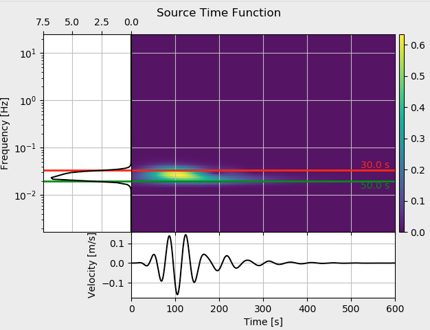

.. centered:: Last updated on *February 23rd 2018*.

Generating Input Files
----------------------

**LASIF** is capable of producing input files for Salvus.
It knows what data is available for every event and thus can generate
these files fully automatically.

The input files are generated for specific iterations and are stored in
the *SALVUS_INPUT_FILES/ITERATION_{iteration_name}* folder.

Input File Generation
^^^^^^^^^^^^^^^^^^^^^

The actual input file generation is now very straightforward:

.. code-block:: bash

    $ lasif generate_input_files ITERATION_NAME EVENT_NAME SIMULATION_TYPE

``SIMULATION_TYPE`` has to be one of

    * ``forward`` - Run a forward simulation and store a wavefield.
        If you do not want to store a wavefield you can use the ``step_length``
        option. Storing the wavefield generally requires a large diskspace.
    * ``adjoint`` - Run the adjoint simulation to calculate gradients (sensitivity kernels).
        for your event/station pairs. This requires
        the adjoint sources to be calculated. More on that later on.
    * ``step_length`` - Optimize change in velocity model.
        This simulation is run to optimize how much your model
        parameters are changed with respect to the gradients.

If no EVENT_NAME is specified, all known events will be used.

For this tutorial you can generate input files for both events with

.. code-block:: bash

    $ lasif generate_input_files 1 --simulation_type forward

This will generate files that Salvus needs to be able to run its forward
simulation with a subsequent adjoint simulation in mind. The
source-time-function (STF) is calculated and the location of the seismic
stations and events are written into a .toml file using the salvus coordinates.
This also creates files which can be used to position your stations and events
on your mesh to inspect in paraview. By now your directory structure is getting
quite large, but it should look something like this:

.. code-block:: none

    .
    ├── ADJOINT_SOURCES
    │   └── ITERATION_1
    ├── DATA
    │   ├── CORRELATIONS
    │   └── EARTHQUAKES
    │       ├── GCMT_event_TURKEY_Mag_5.1_2010-3-24-14-11.h5
    │       └── GCMT_event_TURKEY_Mag_5.9_2011-5-19-20-15.h5
    ├── FUNCTIONS
    │   ├── __init__.py
    │   ├── __pycache__
    │   │   ├── preprocessing_function_asdf.cpython-36.pyc
    │   │   └── source_time_function.cpython-36.pyc
    │   ├── light_preprocessing.py
    │   ├── preprocessing_function_asdf.py
    │   ├── process_data.py
    │   ├── process_synthetics.py
    │   ├── source_time_function.py
    │   └── window_picking_function.py
    ├── GRADIENTS
    ├── MODELS
    │   ├── ITERATION_1
    │   └── Turkey.e
    ├── OUTPUT
    │   ├── LOGS
    │   └── raydensity_plots
    │       └── 2018-02-23T08-38-48__raydensity
    │           └── raydensity.png
    ├── PROCESSED_DATA
    │   ├── CORRELATIONS
    │   └── EARTHQUAKES
    │       ├── GCMT_event_TURKEY_Mag_5.1_2010-3-24-14-11
    │       │   └── preprocessed_30s_to_50s.h5
    │       └── GCMT_event_TURKEY_Mag_5.9_2011-5-19-20-15
    │           └── preprocessed_30s_to_50s.h5
    ├── SALVUS_INPUT_FILES
    │   └── ITERATION_1
    │       ├── GCMT_event_TURKEY_Mag_5.1_2010-3-24-14-11
    │       │   └── forward
    │       │       ├── Heaviside.h5
    │       │       ├── receivers.toml
    │       │       ├── receivers_paraview.csv
    │       │       ├── run_salvus.sh
    │       │       ├── source.toml
    │       │       └── source_paraview.csv
    │       └── GCMT_event_TURKEY_Mag_5.9_2011-5-19-20-15
    │           └── forward
    │               ├── Heaviside.h5
    │               ├── receivers.toml
    │               ├── receivers_paraview.csv
    │               ├── run_salvus.sh
    │               ├── source.toml
    │               └── source_paraview.csv
    ├── SETS
    │   ├── WEIGHTS
    │   │   └── WEIGHTS_A
    │   │       └── WEIGHTS_A.toml
    │   └── WINDOWS
    ├── SYNTHETICS
    │   ├── CORRELATIONS
    │   └── EARTHQUAKES
    │       └── ITERATION_1
    └── lasif_config.toml

In general it is advisable to never delete the input files to
facilitate provenance and reproducibility.

Together with the model files for a given iteration model, these files can
directly be used to run Salvus simulations. For the first couple of runs it is
likely a good idea to check these files by hand in order to verify your setup.

Source Time Functions
^^^^^^^^^^^^^^^^^^^^^

As mentioned before the STF is generated and written to file when you
generate the input files. The STF is written into a hdf5 file and it will
make the STF that you specify in the configuration file. Currently the only
supported STF is the bandpass filtered Heaviside function. It is filtered
in the same way as the data so the synthetics do not have to be filtered
afterwards.

The source-time-function will always be defined for the number of time steps
and the time increment you specify in the solver settings.
To have a quick look at the source time function, use
the ``plot_stf`` command with the iteration name:

.. code-block:: bash

    $ lasif plot_stf

This command will read the corresponding iteration file and open a plot with a
time series and a time frequency representation of the source time function.

