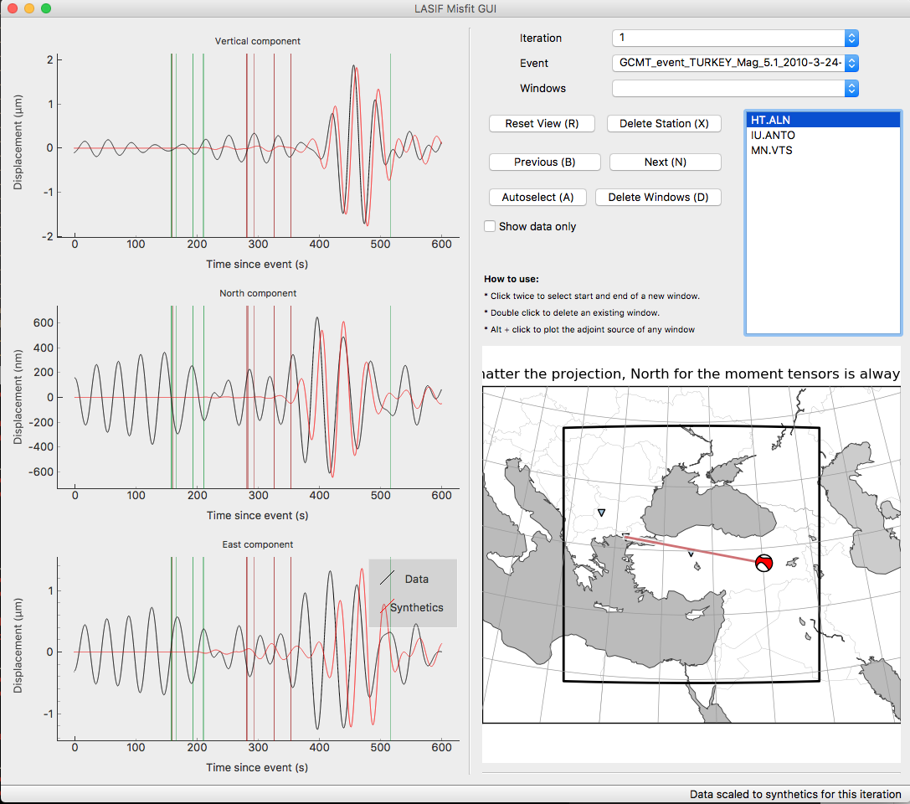
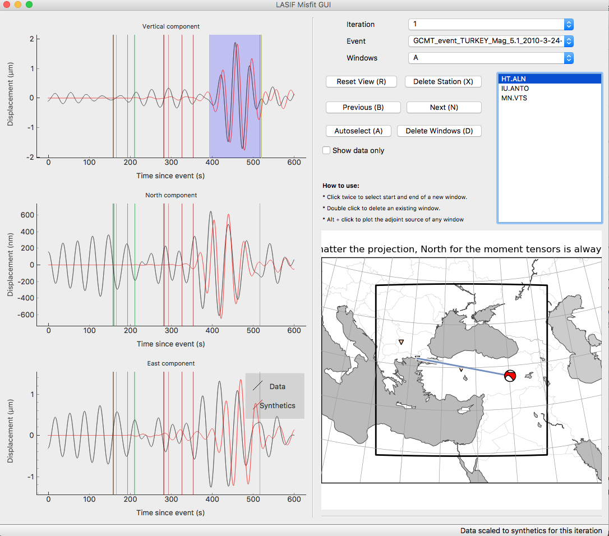

.. centered:: Last updated on *February 23rd 2018*.

Misfit and Adjoint Source Calculation
-------------------------------------

In order to calculate sensitivity kernels (gradients) for a given combination
of model and data, one needs calculate the adjoint sources. An adjoint source
is usually dependent on the misfit between the synthetics and real data.

LASIF currently supports misfits in the time-frequency domain as defined by
`Fichtner et al. (GJI 2008)
<https://doi.org/10.1111/j.1365-246X.2008.03923.x>`_ Great care has to be taken
to avoid cycle skips/phase jumps between synthetics and data. This is achieved
by careful windowing.

Weighting Scheme
^^^^^^^^^^^^^^^^

You may notice that at various points it is possible to
distribute weights. These weights all contribute to the final adjoint source.
The inversion scheme requires one adjoint source per iteration, event, station,
and component.

We already described the ``lasif compute_station_weights`` function that
weighs stations up and down depending on the average distance to the other
stations. But it is also possible to weigh events up or down depending on
preference. Right now this is only possible to do manually but we might add
an automatic function that applies a similar scheme as the station weights.
If you have already computed station weights like we did in this tutorial
you can access the weights in the file */SETS/WEIGHTS/WEIGHTS_A/WEIGHTS_A.TOML*.
In there you can manually modify the weights of the events which will in the
end influence the adjoint sources. If you have however not yet computed
station weights and you only want to modify event weights you can do so by
running ``lasif create_weight_set A`` and then modify the same file.

After we have computed windows, which we will do later we can modify the
weights of the windows but more on that later.

Assuming :math:`N` windows in a given component, the corresponding
adjoint sources will be called :math:`adj\_source_{1..N}` while their
weights are :math:`w_{1..N}`. The final adjoint source for every component
will be calculated according to the following formula:

.. math::

   adj\_source = w_{event} \cdot w_{station} \cdot \frac{1}{\sum_{i=1}^N w_i} \cdot \sum_{i=1}^N w_i \cdot ad\_src_i

Misfit GUI
^^^^^^^^^^

LASIF comes with a graphical utility called the Misfit GUI, that helps to pick
correct windows. To launch it, simply type

.. code-block:: bash

    $ lasif launch_misfit_gui

This will open a window that looks like the following:

In the top right part of the GUI, you can choose which iteration and which
event you want to see the synthetics of. The scroll menu shows all the stations
for which data are available, and you can go to the next station using either
mouse or keyboard up/down arrows. The map in the bottom right will show which
event-station combination is currently plotted.

With the **Next** and **Prev** button you can jump from one station to the
next. The **Delete Windows** button will remove all windows for the current
station. **Autoselect** will run the automatic window selection algorithm for
the currently selected station. It is possible to zoom into the waveforms
and then press **Reset View** to get back. If a station shows flawed data
and you do not want to use it, you can press **Delete Station** and it will
remove the station from the raw data for this event.

It is possible to display only the data and in that case it is possible to
experiment with processing parameters by processing the waveforms as they are
displayed.

To actually choose a window click twice - once for the start and once for the
end of a window. It will be saved and the adjoint source will be calculated.
You can then edit the window by dragging its endpoints.

Double clicking on an already existing window will delete it, ``Alt`` +
clicking will show the time frequency phase misfit as well as the calculated
adjoint source.

The windows are saved in a toml file in *SETS/WINDOWS/*. This is where you
can adjust the window weights.

The misfit GUI is still under development and we are on a constant quest to
improve it. If you have any idea on how it might be improved, please contact
the developers.

Window Selection
^^^^^^^^^^^^^^^^

As an alternative to going through each event-station pair, you can tell LASIF
to select the windows automatically using. (Keep in mind that this can be quite
time consuming)

.. code-block:: bash

   $ mpirun -n 4 lasif select_windows 1 A

for all events, iteration 1 and weight set A. This currently only works with
mpi so you have to use that for the automatic window selection but modify the
number behind the -n to the amount of cores you can/want to use. If you only
want to select windows for a specific event you can specify the event name
as a last argument. **Use these tools with caution and check their result!**

When the misfit GUI is opened again, it can display the windows from
each window set you have. Now it looks like this:

Here you can verify and modify your windows at will using the previously
described functionalities.
As well as looking at the windows in the GUI, LASIF comes with a number of
utilities to help judging the quality of the selected windows. Two of them
are: (Below is an example from another project.)

.. code-block:: bash

    $ lasif plot_windows EVENT_NAME WEIGHT_SET
    $ lasif plot_window_statistics WEIGHT_SET EVENT_NAME

.. image:: ../images/combined_selected_windows.png
    :width: 90%
    :align: center

Final Adjoint Source Calculation
^^^^^^^^^^^^^^^^^^^^^^^^^^^^^^^^

To calculate the adjoint sources and store them you can run:

.. code-block:: bash

    $ mpirun -n 4 lasif calculate_adjoint_sources 1 A

This currently only works with mpi and it can also work for one event at a time
by inputting the event name at the end. This will take each adjoint source
for each station with a window, combine them into one waveform and rotate
them to the correct frame of reference that Salvus expects.

If you change your windows or any weights you will need to calculate the
adjoint sources again.

Now that the adjoint sources are ready, you should be able to generate
input files for your adjoint simulation.

.. code-block:: bash

    $ lasif generate_input_files 1 adjoint

Now everything should be ready to run your adjoint simulation and calculate
a gradient (sensitivity kernel).
