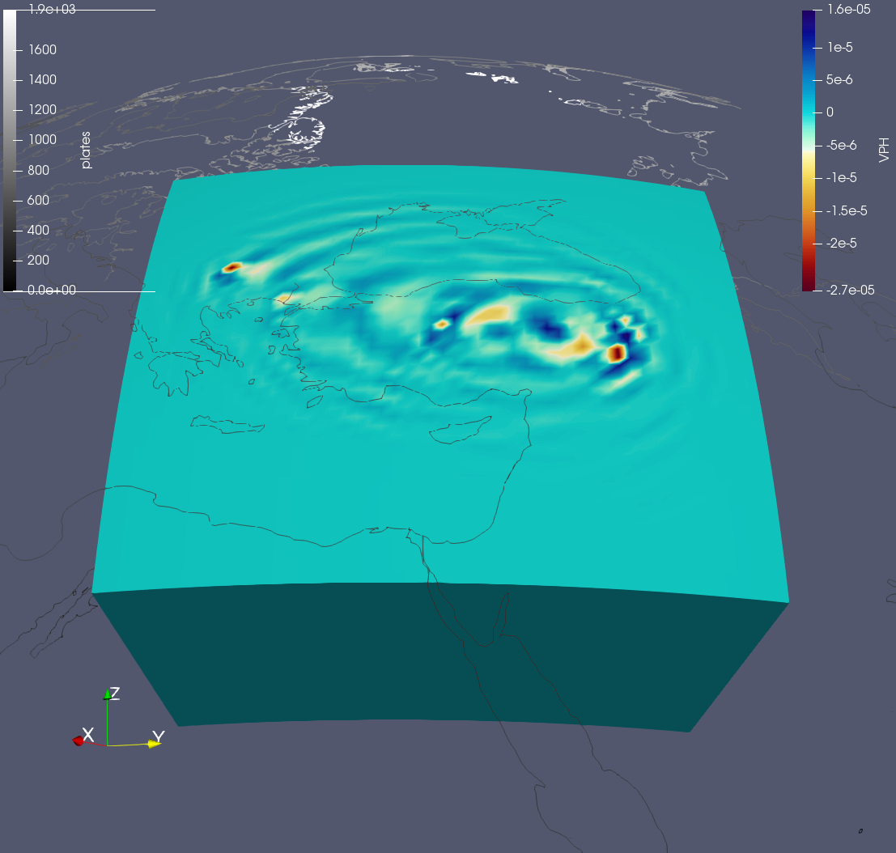
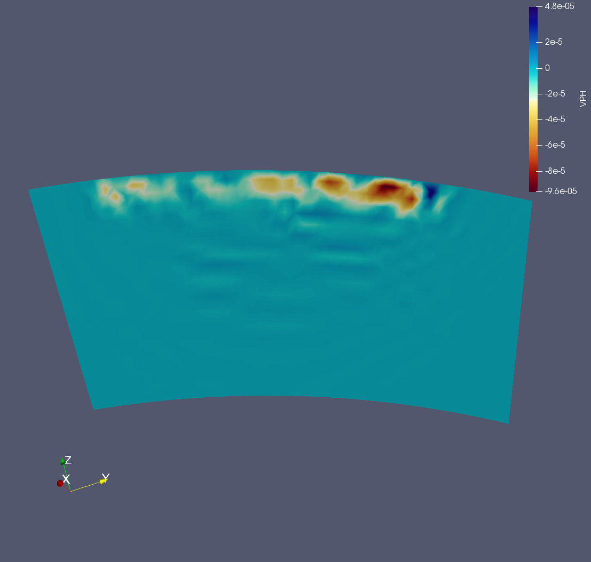

.. centered:: Last updated on *February 23rd 2018*.

Gradient Visualization
----------------------

After running the adjoint simulation you should be able to find a gradient.
This gradient should be put into the ``GRADIENTS/ITERATION_1/EVENT_NAME/``
folder. Your gradient should be on an exodus format so you should be able to
visualize it using Paraview.

Here are screenshots showing an example of how a gradient can look for this
little tutorial project. First one shows the top view of the gradient
calculated for the Vpv velocity component and the other one shows a cross
section straight through the gradient.

After looking at the computed gradients to make sure that they are looking fine
you have to sum all your gradients into one and run a ``step_length simulation``.
Currently **LASIF** does not provide an option to sum your gradients but it
is/will be possible using Salvus. So currently this tutorial does not go any
further but it will be updated later.

Finally, this is more or less how your directory structure should look like.
Files may change depending on Salvus settings:

.. code-block:: bash

    .
    ├── ADJOINT_SOURCES
    │   └── ITERATION_1
    │       ├── ADJ_SRC_GCMT_event_TURKEY_Mag_5.1_2010-3-24-14-11.h5
    │       └── ADJ_SRC_GCMT_event_TURKEY_Mag_5.9_2011-5-19-20-15.h5
    ├── DATA
    │   ├── CORRELATIONS
    │   └── EARTHQUAKES
    │       ├── GCMT_event_TURKEY_Mag_5.1_2010-3-24-14-11.h5
    │       └── GCMT_event_TURKEY_Mag_5.9_2011-5-19-20-15.h5
    ├── FUNCTIONS
    │   ├── __init__.py
    │   ├── __pycache__
    │   │   ├── preprocessing_function_asdf.cpython-36.pyc
    │   │   ├── process_synthetics.cpython-36.pyc
    │   │   ├── source_time_function.cpython-36.pyc
    │   │   └── window_picking_function.cpython-36.pyc
    │   ├── light_preprocessing.py
    │   ├── preprocessing_function_asdf.py
    │   ├── process_data.py
    │   ├── process_synthetics.py
    │   ├── source_time_function.py
    │   └── window_picking_function.py
    ├── GRADIENTS
    │   └── ITERATION_1
    │       ├── GCMT_event_TURKEY_Mag_5.1_2010-3-24-14-11
    │       │   ├── kernel.e
    │       │   ├── static_model.h5
    │       │   ├── static_model_ELASTIC.xdmf
    │       │   ├── stderr
    │       │   └── stdout
    │       └── GCMT_event_TURKEY_Mag_5.9_2011-5-19-20-15
    │           ├── kernel.e
    │           ├── static_model.h5
    │           ├── static_model_ELASTIC.xdmf
    │           ├── stderr
    │           └── stdout
    ├── MODELS
    │   ├── ITERATION_1
    │   └── Turkey.e
    ├── OUTPUT
    │   ├── LOGS
    │   └── raydensity_plots
    │       └── 2018-02-23T08-38-48__raydensity
    │           └── raydensity.png
    ├── PROCESSED_DATA
    │   ├── CORRELATIONS
    │   └── EARTHQUAKES
    │       ├── GCMT_event_TURKEY_Mag_5.1_2010-3-24-14-11
    │       │   └── preprocessed_30s_to_50s.h5
    │       └── GCMT_event_TURKEY_Mag_5.9_2011-5-19-20-15
    │           └── preprocessed_30s_to_50s.h5
    ├── SALVUS_INPUT_FILES
    │   └── ITERATION_1
    │       ├── GCMT_event_TURKEY_Mag_5.1_2010-3-24-14-11
    │       │   ├── adjoint
    │       │   │   ├── adjoint.toml
    │       │   │   ├── adjoint_source.h5
    │       │   │   └── run_salvus.sh
    │       │   └── forward
    │       │       ├── Heaviside.h5
    │       │       ├── receivers.toml
    │       │       ├── receivers_paraview.csv
    │       │       ├── run_salvus.sh
    │       │       ├── source.toml
    │       │       └── source_paraview.csv
    │       └── GCMT_event_TURKEY_Mag_5.9_2011-5-19-20-15
    │           ├── adjoint
    │           │   ├── adjoint.toml
    │           │   ├── adjoint_source.h5
    │           │   └── run_salvus.sh
    │           └── forward
    │               ├── Heaviside.h5
    │               ├── receivers.toml
    │               ├── receivers_paraview.csv
    │               ├── run_salvus.sh
    │               ├── source.toml
    │               └── source_paraview.csv
    ├── SETS
    │   ├── WEIGHTS
    │   │   └── WEIGHTS_A
    │   │       └── WEIGHTS_A.toml
    │   └── WINDOWS
    │       └── A.sqlite
    ├── SYNTHETICS
    │   ├── CORRELATIONS
    │   └── EARTHQUAKES
    │       └── ITERATION_1
    │           ├── GCMT_event_TURKEY_Mag_5.1_2010-3-24-14-11
    │           │   ├── receivers.h5
    │           │   ├── stderr
    │           │   └── stdout
    │           └── GCMT_event_TURKEY_Mag_5.9_2011-5-19-20-15
    │               ├── receivers.h5
    │               ├── stderr
    │               └── stdout
    └── lasif_config.toml

For any questions or inputs on **LASIF** please contact the developers.
