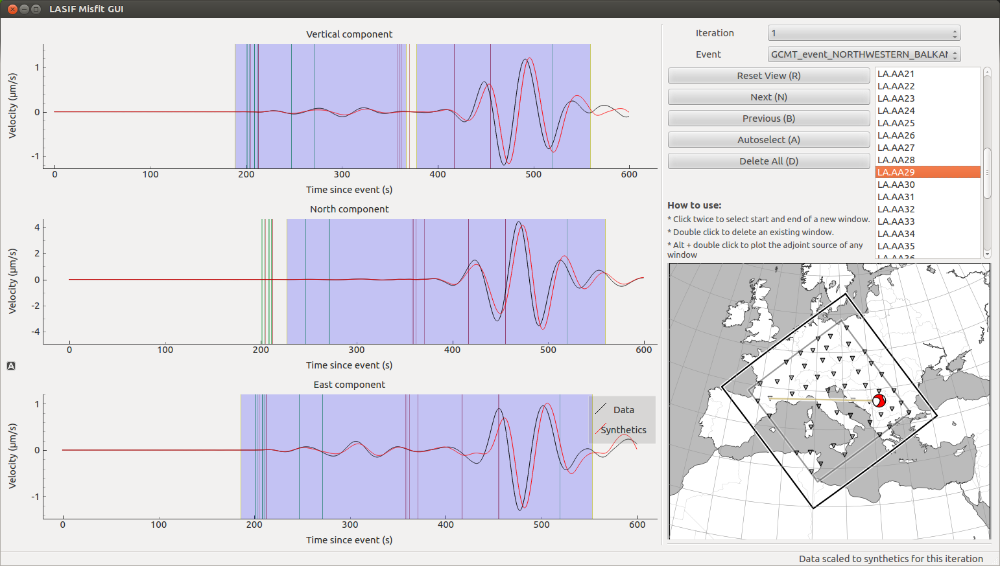
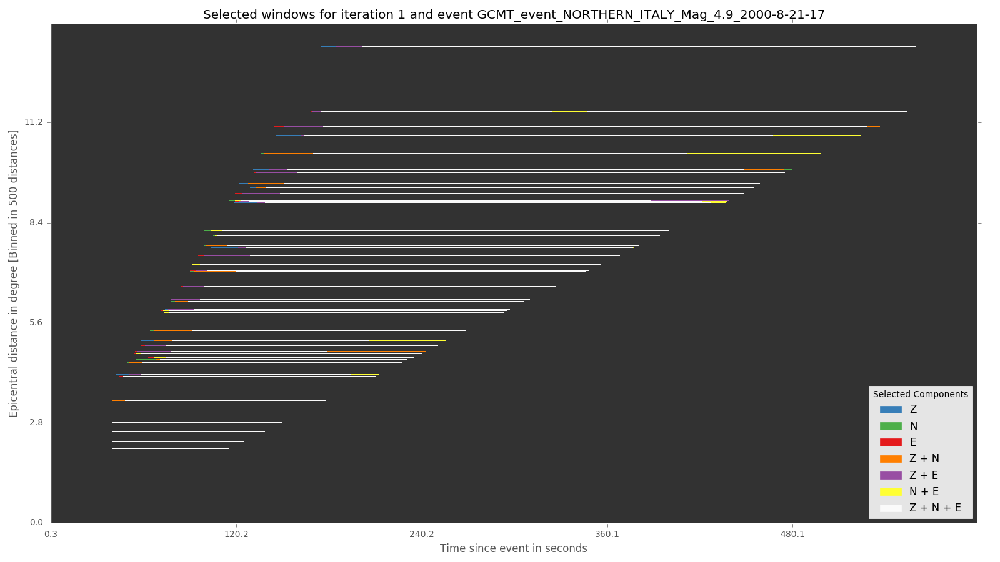
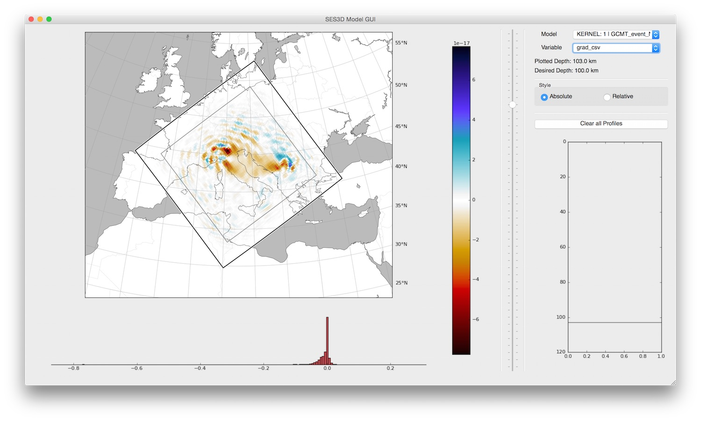

.. centered:: Last updated on *August 12th 2016*.

.. note::

    The following links shows the example project as it should be just before
    step 13. You can use this to check your progress or restart the tutorial at
    this very point.

    `After Step 13: Synthetics <https://github.com/krischer/LASIF_Tutorial/tree/after_step_13_synthetics>`_

Misfit and Adjoint Source Calculation
-------------------------------------

In order to calculate sensitivity kernels (gradients) for a given combination
of  model and data, one needs calculate the adjoint sources. An adjoint source
is usually dependent on the misfit between the synthetics and real data.

LASIF currently supports misfits in the time-frequency domain as defined by
`Fichtner et al. (GJI 2008)
<https://doi.org/10.1111/j.1365-246X.2008.03923.x>`_ Great care has to be taken
to avoid cycle skips/phase jumps between synthetics and data. This is achieved
by careful windowing.

Weighting Scheme
^^^^^^^^^^^^^^^^

You may notice that at various points it is possible to
distribute weights. These weights all contribute to the final adjoint source.
The inversion scheme requires one adjoint source per iteration, event, station,
and component.

In each iteration's XML file you can specify the weight for each event, denoted
as :math:`w_{event}` and within each event, the weight per station
:math:`w_{station}`. Both weights are allowed to range between
0.0 and 1.0. A weight of 0.0 corresponds to no weight at all, e.g. skip the
event and a weight of 1.0 is the maximum weight.

.. Within each event, it is possible to assign a weight :math:`w_{station}` to
.. each separate station. The station weights can also range from
.. 0.0 to 1.0 and follow the same logic as the event weights, also editable in
.. the iteration XML file.

.. code-block:: xml

    <?xml version='1.0' encoding='UTF-8'?>
    <iteration>
      <iteration_name>1</iteration_name>
      ...
      <event>
        <event_name>GCMT_event_NORTHWESTERN_BALKAN_REGION_Mag_5.9_1980-5-18-20-2</event_name>
        <event_weight>1.0</event_weight>
        <station>
          <station_id>LA.AA22</station_id>
          <station_weight>1.0</station_weight>
        </station>
        <station>
          ...
        </station>
      </event>
        ...
      <event>
      </event>
    </iteration>

You can furthermore choose an arbitrary number of windows per component for
which the misfit and adjoint source will be calculated. Each window has a
separate weight, with the only limitation being that the weight has to be
positive. These weights can be edited after the windows have been selected.

Assuming :math:`N` windows in a given component, the corresponding
adjoint sources will be called :math:`adj\_source_{1..N}` while their
weights are :math:`w_{1..N}`. The final adjoint source for every component
will be calculated according to the following formula:

.. math::

   adj\_source = w_{event} \cdot w_{station} \cdot \frac{1}{\sum_{i=1}^N w_i} \cdot \sum_{i=1}^N w_i \cdot ad\_src_i

Misfit GUI
^^^^^^^^^^

LASIF comes with a graphical utility called the Misfit GUI, that helps to pick
correct windows. To launch it, simply type

.. code-block:: bash

    $ lasif launch_misfit_gui

This will open a window that looks like the following:

In the top right part of the GUI, you can choose which iteration and which
event you want to see the synthetics of. The scroll menu shows all the stations
for which data are available, and you can go to the next station using either
mouse or keyboard up/down arrows. The map in the bottom right will show which
event-station combination is currently plotted.

With the **Next** and **Prev** button you can jump from one station to the
next. The **Delete All** button will remove all windows for the current
station. **Autoselect** will run the automatic window selection algorithm for
the currently selected station.

To actually choose a window click twice - once for the start and once for the
end of a window. It will be saved and the adjoint source will be calculated.

Double clicking on an already existing window will delete it, ``Alt`` +
clicking will show the time frequency phase misfit as well as the calculated
adjoint source.

The windows are saved in the window XML files (saved on a
per-station basis in the
``ADJOINT_SOURCES_AND_WINDOWS/WINDOWS/{{EVENT_NAME}}/ITERATION_{{ITERATION_NAME}}/`` folder), and currently, this is the only place where the window
weights can be adjusted.

Window Selection
^^^^^^^^^^^^^^^^

As an alternative to going through each event-station pair, you can tell LASIF
to select the windows automatically using

.. code-block:: bash

   $ lasif select_windows 1 GCMT_event_NORTHWESTERN_BALKAN_REGION_Mag_5.9_1980-5-18-20-2

for a single event in iteration 1, or

.. code-block:: bash

   $ lasif select_all_windows

for all events in the iteration (the latter can also be run with ``mpirun -n X
...``. **Use these tools with caution and check their result!**

LASIF comes with a number of utilities to judge the quality of selected
windows. One of these plots a summary of the temporal and epicentral distance
distribution of selected events:

.. code-block:: bash

    $ lasif plot_windows --combine 1 GCMT_event_NORTHERN_ITALY_Mag_4.9_2000-8-21-17

Final Adjoint Source Calculation
^^^^^^^^^^^^^^^^^^^^^^^^^^^^^^^^

During window selection, the adjoint source for each chosen window will be
stored separately. To combine them, apply the weighting scheme and convert them
to a format, that SES3D can actually use, run the ``finalize_adjoint_sources``
command with the iteration name and the event name.

.. code-block:: bash

    $ lasif finalize_adjoint_sources 1 GCMT_event_NORTHERN_ITALY_Mag_4.9_2000-8-21-17
    $ lasif finalize_adjoint_sources 1 GCMT_event_NORTHWESTERN_BALKAN_REGION_Mag_5.9_1980-5-18-20

This will also rotate the adjoint sources to the frame of reference used in the
simulations.

If you pick any more windows or change them in any way, you need to run the
command again. The result of that command is a list of adjoint sources directly
usable by SES3D in the ``OUTPUT`` folder.

Copy these to the correct folder inside your SES3D installation, make sure to
tell SES3D to perform an adjoint reverse simulation and launch it. Please refer
to the SES3D manual for the necessary details.

Gradient visualisation
^^^^^^^^^^^^^^^^^^^^^^

It is possible to view the raw gradients from a SES3D simulation.  To do this,
simply put them, along with the ``boxfile`` that is used in SES3D, in the a
folder according to the following scheme:

``KERNELS/ITERATION_{{ITERATION_NAME}}/{{EVENT_NAME}}``

For the example in the tutorial this results in the two folders:

*  ``KERNELS/ITERATION_1/GCMT_event_NORTHERN_ITALY_Mag_4.9_2000-8-21-17-14``
*  ``KERNELS/ITERATION_1/GCMT_event_NORTHWESTERN_BALKAN_REGION_Mag_5.9_1980-5-18-20-2``

If the folder inside an iteration has the name of an event it is assumed to be
the gradient from that particular event. If it has any other name it can still
be plotted but you have to take care of the meaning.

The ``plot_kernel`` command can be used to plot the gradients/kernels and
usage is similar to the ``plot_events`` command. However, components are now
called ``grad_{{COMPONENT}}`` -- the same component names as the files
you copied into the kernels folder. So to plot the gradient for SV velocity
at 50 km depth for the first event, type

.. code-block:: bash

    $ lasif plot_kernel KERNELS/ITERATION_1/GCMT_event_NORTHERN_ITALY_Mag_4.9_2000-8-21-17/ 50 grad_csv Kernel.050km.vsv.png

Note that the kernel for vsv is called grad\_\ **c**\ sv -- likewise for the
other velocities.

Alternatively, you can again use the model gui in order to explore the
kernels. This works exactly the same as before, just select your favourite
``KERNEL: {{ITERATION_NAME}} | {{EVENT_NAME}}``. If all is well, it looks
like this for the **raw, unsmoothed** vsv kernel:

