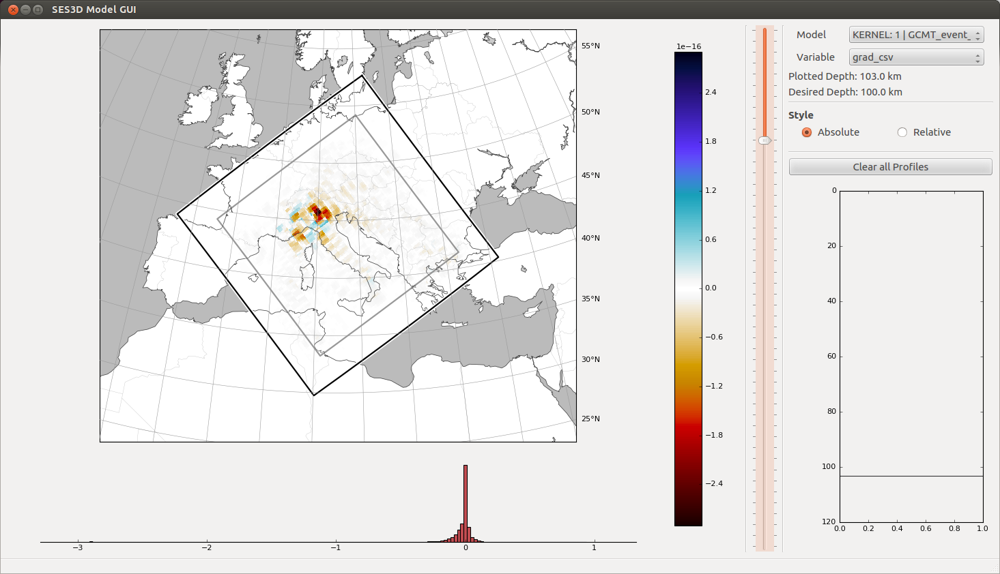

Model Update
------------

LASIF does not currently aid you with updating the model so this is still a
fairly manual process. We are in the process of correcting this. *(last
updated 14 June 2016)*

Gradient visualisation
^^^^^^^^^^^^^^^^^^^^^^

Right now it is possible to view the raw gradients from a SES3D simulation.
To do this, simply put them, along with the ``boxfile`` that is used in
SES3D, in the a folder according to the following scheme:

``KERNELS/ITERATION_{{ITERATION_NAME}}/{{EVENT_NAME}}``

For the example in the tutorial this results in the two folders:

*  ``KERNELS/ITERATION_1/GCMT_event_NORTHERN_ITALY_Mag_4.9_2000-8-21-17-14``
*  ``KERNELS/ITERATION_1/GCMT_event_NORTHWESTERN_BALKAN_REGION_Mag_5.9_1980-5-18-20-2``

If the folder inside an iteration has the name of an event it is assumed to
be the gradient from that particular event. If it has any other name it can
still be plotted but you have to take care of the meaning.

The ``plot_kernel`` command can be used to plot the gradients/kernels and
usage is similar to the ``plot_events`` command. However, components are now 
called ``grad_{{COMPONENT}}`` -- the same component names as the files
you copied into the kernels folder. So to plot the gradient for SV velocity
at 50 km depth for the first event, type

.. code-block:: bash

    $ lasif plot_kernel KERNELS/ITERATION_1/GCMT_event_NORTHERN_ITALY_Mag_4.9_2000-8-21-17/ 50 grad_csv Kernel.050km.vsv.png

Note that the kernel for vsv is called grad\_\ **c**\ sv -- likewise for the 
other velocities.

Alternatively, you can again use the model gui in order to explore the
kernels. This works exactly the same as before, just select your favourite
``KERNEL: {{ITERATION_NAME}} | {{EVENT_NAME}}``. If all is well, it looks
like this for the **raw, unsmoothed** vsv kernel:

Actual model update
^^^^^^^^^^^^^^^^^^^

Because LASIF does not (yet) aid you with updating the model, you will have
to do this manually. Keep in mind that the kernels SES3D produces initially
are the raw gradients, and unsmoothed. You will probably need to smooth them
before updating the model to get reasonable results without excessive 
focusing near sources and/or receivers.
