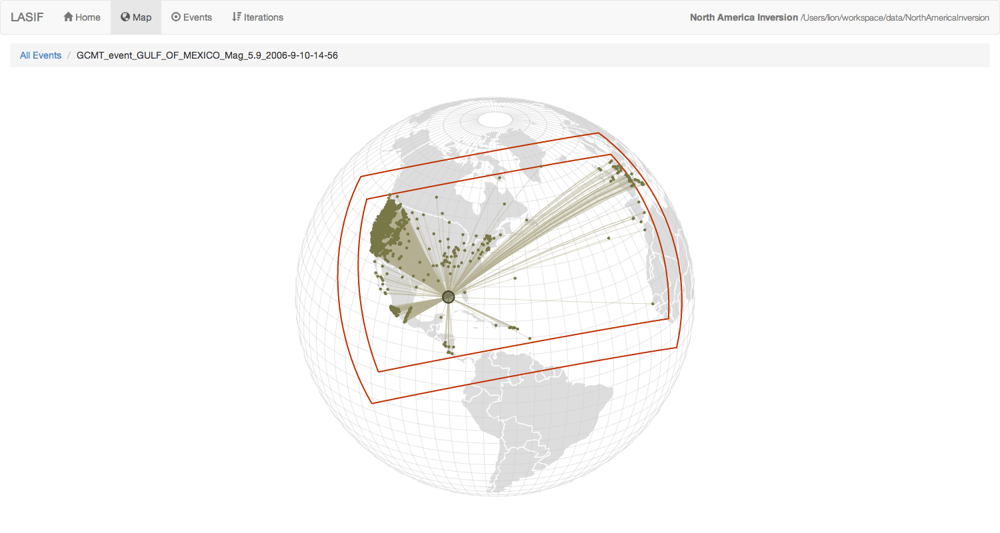
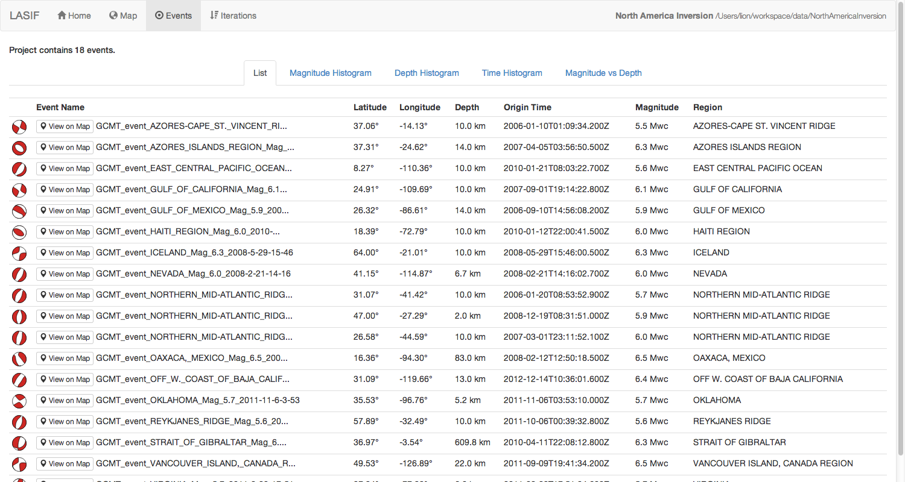
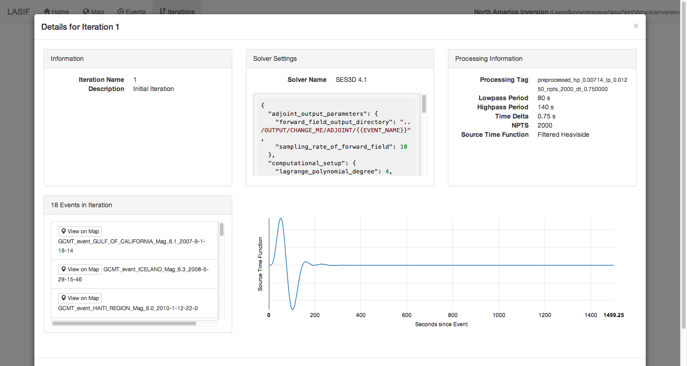

Web Interface
=============

The web interface is a way to interactively explore a LASIF project and the
data within. To start it, simply execute the following command inside the
folder structure of a LASIF project:

.. code-block:: bash

    $ lasif serve

This will start a local web server and open the website in your browser. It
heavily relies on JavaScript so make sure it is not disabled. Please also use
a modern and up-to-date browser. I tested it with Firefox, Chrome, and Safari;
Firefox being the slowest of the bunch.

The webinterface is designed to display the state of a project at the time
the ``serve`` command is executed. If you modify the state of a project
while the web server is running, the result is undefined. Please restart the
server in that case.

Here are a couple of screenshots highlighting some features of the web
interface. Click on them for full size.

    Interactive map capable of showing the domain boundaries, events,
    and per-event recording stations including raypaths.

.. figure:: images/webinterface/2.png
    :width: 100%
    :align: center

    Interactive waveform plotting.

    List of all events with some more information.

.. figure:: images/webinterface/4.png
    :width: 100%
    :align: center

    Various interactive plots related to event distributions.

    Detailed information about the defined iterations.
